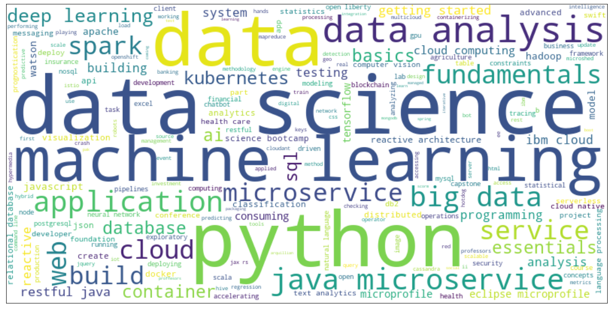

# Deployment of an AI Course Recommender System Using Streamlit

This project implements and deploys an AI course Recommender System using [Streamlit](https://streamlit.io/).

The deployed application was inspired by the the [IBM Machine Learning Professional Certificate](https://www.coursera.org/professional-certificates/ibm-machine-learning) offered by IBM & Coursera. In the last course/module of the Specialization, Machine Learning Capstone, a similar application is built; check my [class notes](https://github.com/mxagar/machine_learning_ibm/tree/main/06_Capstone_Project/06_Capstone_Recommender_System.md) for more information.

## Dataset

The dataset is composed of the following files, located in [`data/`](data), and which can be downloaded from the following links:

- [`course_genre.csv`](https://cf-courses-data.s3.us.cloud-object-storage.appdomain.cloud/IBM-ML321EN-SkillsNetwork/labs/datasets/course_genre.csv)
- [`ratings.csv`](https://cf-courses-data.s3.us.cloud-object-storage.appdomain.cloud/IBM-ML321EN-SkillsNetwork/labs/datasets/ratings.csv)
- [`course_processed.csv`](https://cf-courses-data.s3.us.cloud-object-storage.appdomain.cloud/IBM-ML321EN-SkillsNetwork/labs/datasets/course_processed.csv)
- [`user_profile.csv`](https://cf-courses-data.s3.us.cloud-object-storage.appdomain.cloud/IBM-ML321EN-SkillsNetwork/labs/datasets/user_profile.csv)
- [`rs_content_test.csv`](https://cf-courses-data.s3.us.cloud-object-storage.appdomain.cloud/IBM-ML321EN-SkillsNetwork/labs/datasets/rs_content_test.csv)

The **course catalogue** is contained in [`course_genre.csv`](data/course_genre.csv), which consists of 307 course entries, each with 16 features:

- `COURSE_ID`
- `TITLE`
- 14 (binary) topic or genre fields: `'Database', 'Python', 'CloudComputing', 'DataAnalysis', 'Containers', 'MachineLearning', 'ComputerVision', 'DataScience', 'BigData', 'Chatbot', 'R', 'BackendDev', 'FrontendDev', 'Blockchain'`.

The table [`course_processed.csv`](data/course_processed.csv) complements [`course_genre.csv`](data/course_genre.csv) by adding one new field/column associated with each course: `DESCRIPTION`.

<p style="text-align:center">
  
  <small style="color:grey">A wordcloud generated from the course titles.</small>
</p>

The **ratings table** is contained in [`ratings.csv`](data/ratings.csv), which consists of 233,306 rating entries, each with 3 features:

- `user`: student id
- `item`: course id, equivalent to `COURSE_ID` in `course_genre.csv`
- `rating`: two possible values:
  - `2`: the user just audited the course without completing it.
  - `3`: the user completed the course and earned a certificate.
  - Other possible values, not present in the dataset: `0` or `NA` (no exposure), `1` (student browser course).

The **user profiles** are contained [`user_profile.csv`](data/user_profile.csv), which consists of 33,901 user entries, each with 14 feature weights each. The weights span from 0 to 63, so I understand they are summed/aggregated values for each student, i.e., the accumulated ratings (2 or 3) of the students for each course feature. In other words, these weights seem not to be normalized.

Some **test user rating data** is provided in [`rs_content_test.csv`](data/rs_content_test.csv). In total, the table has 9,402 entries with values 3 values each: `user` (student id), `item` (`COURSE_ID`), `rating`. Altogether 1000 unique users are contained, so some users have rated some courses.

## How to Use This Project

The directory of the project consists of the following files:

:construction: To be done...

```
.
├── README.md           # This file
...
```

### Installing Dependencies for Custom Environments

If you'd like to work with this repository locally, you need to create a custom environment and install the required dependencies. A quick recipe which sets everything up with [conda](https://docs.conda.io/en/latest/) is the following:

```bash
# Create environment with YAML, incl. packages
conda env create -f conda.yaml
conda activate course-recommender

# Install pip dependencies
pip install requirements.txt
```

:construction: To be done...

List of most important dependencies:

- Pandas
- Numpy
- Matplotlib
- Seaborn
- Wordcloud
- Scikit-Learn
- Streamlit

Also, note that **the notebooks can be opened in Google Colab** by clicking on the icon provided in each of them.

## Background: Content-Based vs. Collaborative-Filtering Recommender Systems

[Matrix_Factorization.pdf](./assets/Matrix_Factorization.pdf)

:construction: To be done...

## Notes on the Implemented Analysis and Modeling

:construction: To be done...

### Summary of Contents

:construction: To be done...

- [ ] A
- [ ] B

## Results and Conclusions

:construction: To be done...

## Next Steps, Improvements

:construction: To be done...

## References and Links

:construction: To be done...

## Authorship

Mikel Sagardia, 2022.  
No guarantees.

If you find this repository useful, you're free to use it, but please link back to the original source.

This project was inspired by the the [IBM Machine Learning Professional Certificate](https://www.coursera.org/professional-certificates/ibm-machine-learning) offered by IBM & Coursera. In the last course/module of the Specialization, Machine Learning Capstone, a similar application is built; check my [class notes](https://github.com/mxagar/machine_learning_ibm/tree/main/06_Capstone_Project) for more information.
