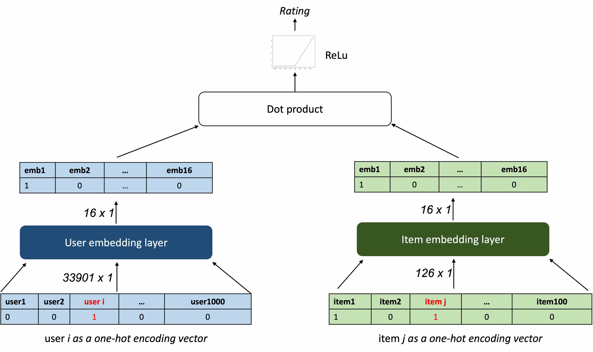
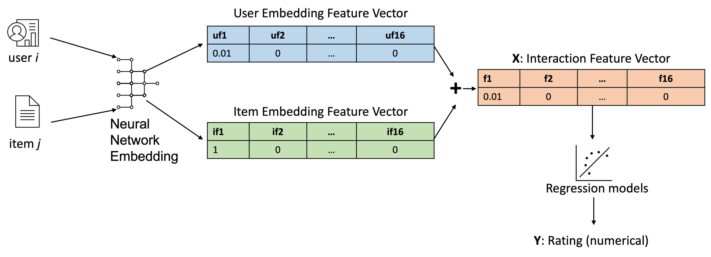

# Course Recommender System: Research Notebooks

This folder contains research notebooks related to the [course_recommender_streamlit](https://github.com/mxagar/course_recommender_streamlit):

- [`01_EDA.ipynb`](01_EDA.ipynb): Fist exposure to the dataset and basic Exploratory Data Analysis (EDA).
  - All titles are joined to created a `wordcloud`.
  - Course counts for topics are analyzed: sorted according to counts (popularity of each topic).
  - Users with most enrollments are ranked.
  - Courses with most enrollments are ranked: 20 most popular.
  - A join (`merge()`) is performed to get course names.
- [`02_FE.ipynb`](02_FE.ipynb): Feature Engineering (FE).
  - Course title and description are merged to form a text field from which features are extracted, i.e., token counts (Bags of Words, BoW).
  - Text field tokenization is performed with NLTK, removing stop words and taking only nouns (after POS tagging).
  - A vocabulary/dictionary is created with gensim.
  - BoWs are created for each course text field, storing them stacked in a dataframe in which each course-token pair has an entry.
  - The created dataframe is pivoted to create sparse BoW entries, one for each course.
  - Similarities between courses are computed: given a course with its BoW sparse array, the most similar ones are found.
- [`03_Content_RecSys.ipynb`](03_Content_RecSys.ipynb): Content-based recommender systems (i.e., item features, e.g., genres, are known):
  1. Recommendations based on user profiles:
      - We consider that the course-genre weights are known.
      - We have a user profile, i.e., a matrix which contains the weight each user gives to a genre/feature. These weights are not normalized.
      - The rating of a user to a new item can be estimated by multiplying (dot product) the user profile vectors with the feature vector of the item. Since there is no normalization, we call that estimation score.
  1. Recommendations based on course similarities:
      - We have computed course similarities (matrix) using the BoWs of course descriptions in the FE notebook.
      - For each test user with the list of courses he/she took, we get the list of unattended courses with a similarity larger than a threshold value.
  2. Recommendations based on user profile clustering:
      - User profiles are reduced to less dimensions with PCA.
      - User profiles are clustered with K-Means applying the elbow method for k value discovery
      - For each user in a cluster, his un-attended courses are found.
      - For each user cluster, the most attended courses are listed.
      - For each user, the most attended courses in theirs cluster are recommended, if these were not visited by them yet.
- [`04_Collaborative_RecSys.ipynb`](04_Collaborative_RecSys.ipynb): collaborative-based recommendation systems (i.e., we don't have item features explicitly) using *classical* methods:
  - A dense user-items ratings table is converted to a sparse table.
  - Item-based and user-based k-NN search is applied to find the closest items/users given their similarity and perform a prediction with a weighted sum. This is done with the [surprise](https://surprise.readthedocs.io/en/stable/index.html) library and manually.
  - Non-Negative Matrix Factorization (NMF) is used to decompose a ratings table into lower rank matrices which encode latent features. This is done with the [surprise](https://surprise.readthedocs.io/en/stable/index.html) library and with Scikit-Learn.
- [`05_Collaborative_RecSys_ANN.ipynb`](05_Collaborative_RecSys_ANN.ipynb): collaborative-based recommendation systems (i.e., we don't have item features explicitly) using Artificial Neural Networks (ANNs):
  - A very simple ANN is created with Keras using OOP, i.e., inheriting the `tensorflow.keras.Model` class. The model takes the dense ratings dataframe encoded with indices and it builds two embeddings: one for the user representations and the other for the item representations. Both embeddings have size 16 and are multiplied (dot product) to predict the rating.
  - The training results in two important embedding matrices, which encode latent features. Therefore, we have the following dataframes:
    - user embeddings: `(33901, 17)`
    - item embeddings: `(126, 17)`
    - ratings (dense): `(233306, 3)`
  - The embeddings are joined to the ratings dataframe so that we get a table of shape `(233306, 3+16+16)`. Then, the two embedding vectors are summed and we collapse the large dataframe to a shape of `(233306, 16+1)`, i.e., 16 features (summed embedding vectors) and the rating (target).
  - With this dataset, regression models are applied:
    - Linear regression.
    - Lasso regression with cross-validation.
    - Ridge regression with cross-validation.
    - Random forest classifier with a grid search.

